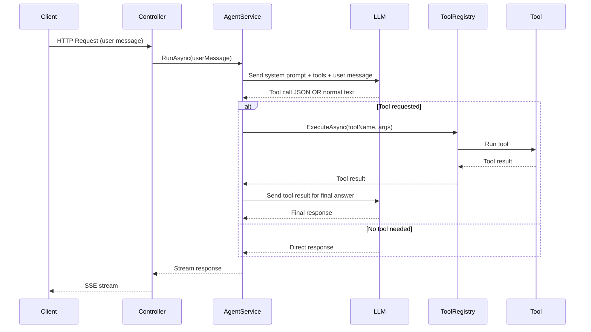

# 🚀 Hybrid Tool-Calling AI Agent  
### ASP.NET Core + Ollama + Streaming + Extensible Tool Registry

A production-ready AI agent built with:

- **ASP.NET Core (.NET 8)**
- **Ollama (local LLM runtime)**
- **Streaming responses (SSE)**
- **Automatic tool selection**
- **Extensible Tool Registry**
- **Hybrid-ready architecture (RAG compatible)**

---

## ✨ Features

- ✅ Streaming responses (`text/event-stream`)
- ✅ Automatic tool detection & execution
- ✅ Structured JSON tool calls
- ✅ Extensible tool registry
- ✅ Clean separation of concerns
- ✅ SQLite (Code First, EF Core)
- ✅ Hybrid RAG-ready architecture

---

# 🏗 Architecture Overview

### Request Flow

