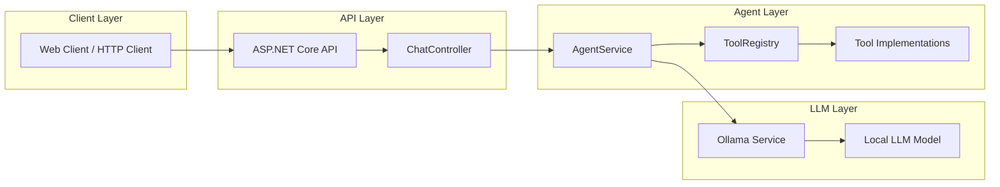
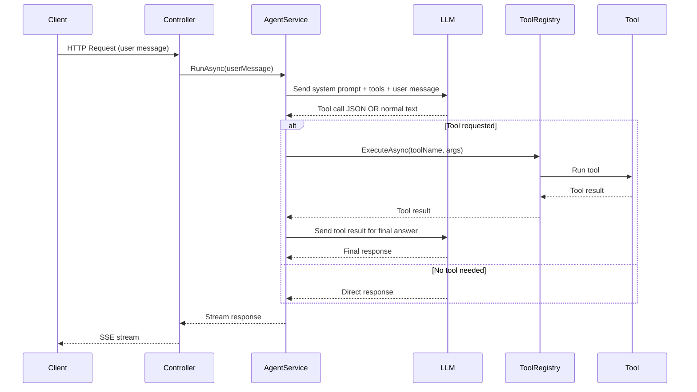

# 🚀 Hybrid Tool-Calling AI Agent  
### ASP.NET Core + Ollama + Streaming + Extensible Tool Registry

 AI agent built with:

- **ASP.NET Core (.NET 8)**
- **Ollama (local LLM runtime)**
- **Streaming responses (SSE)**
- **Automatic tool selection**
- **Extensible Tool Registry**
- **Hybrid-ready architecture (RAG compatible)**

---

## ✨ Features

- ✅ Streaming responses (`text/event-stream`)
- ✅ Automatic tool detection & execution
- ✅ Structured JSON tool calls
- ✅ Extensible tool registry
- ✅ Clean separation of concerns
- ✅ SQLite (Code First, EF Core)
- ✅ Hybrid RAG-ready architecture

---

# 🏗 Architecture Overview

## 🏗 High-Level Architecture



## 🔄 Agent Tool-Calling Execution Flow

## 📋 Prerequisites

Before running this project, ensure the following dependencies are installed:

### 1️⃣ .NET SDK

- .NET 8.0 or later  
- Download: https://dotnet.microsoft.com/download

Verify installation:

```bash
dotnet --version
```

---

### 2️⃣ Ollama (Local LLM Runtime)

This project uses **Ollama** to run local LLM models.

Install Ollama:

- macOS / Linux:
```bash
curl -fsSL https://ollama.com/install.sh | sh
```

- Windows:
Download installer from:
https://ollama.com/download

Verify installation:

```bash
ollama --version
```

---

### 3️⃣ Pull a Supported LLM Model

After installing Ollama, pull a model:

Example (recommended):

```bash
ollama pull llama3
```

Verify the model is available:

```bash
ollama list
```

---

### 4️⃣ Start Ollama Server

Ollama must be running before starting the API:

```bash
ollama serve
```

By default, it runs at:

```
http://localhost:11434
```

## ⚠️ Important

If Ollama is not running, the API will fail when attempting to call the LLM.

Ensure:
- Ollama service is active
- The model is downloaded
- The model name matches your configuration
